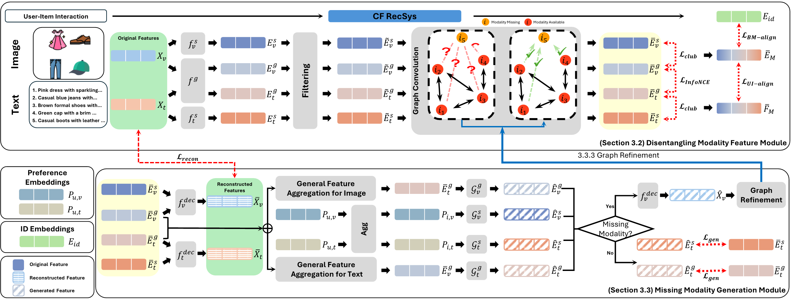

# DGMRec

The official source code for [**DGMRec: Disentangling and Generating Modalities for Recommendation in Missing Modality Scenarios**](https://arxiv.org/abs/2504.16352) (**SIGIR 2025**) and its extended journal version, *Towards Robust Real-World Multi-Modal Recommendation: Disentangling and Generating Missing Modalities* (under review at ACM TORS).

> `main` contains the extended version used for the journal submission: all compared baselines in a single pipeline, pinned per-model configurations and seeds, and one-command reproduction. The original SIGIR 2025 release is preserved on the [`sigir25`](../../tree/sigir25) branch.

## Overview

Multi-modal recommender systems (MRSs) have demonstrated significant success in improving personalization by leveraging diverse modalities such as images, text, and audio. However, they face two critical challenges: (1) addressing missing modality scenarios and (2) effectively disentangling shared and unique characteristics of modalities.
To overcome these challenges, we propose **D**isentangling and **G**enerating **M**odality **Rec**ommender (DGMRec), a novel framework designed for missing modality scenarios.
DGMRec disentangles modality features into general and specific modality features from an information perspective, and generates missing modality features by integrating aligned features from other modalities and leveraging modality preferences.



## Repository layout

| Path | Purpose |
|---|---|
| `src/` | Single source tree for all datasets: the two-modality Amazon sets (Baby / Sports / Clothing / Electronics, image + text) and the three-modality TikTok set (image + text + audio) |
| `src*/configs/best/` | Exact per-model, per-dataset configurations used for the reported results |
| `data/masks/` | The exact missing-modality masks and interaction splits used in the paper |
| `scripts/` | Data download, experiment runner, and result aggregation |

**One tree, two modality structures.** The Amazon datasets carry two
modalities while TikTok carries three (image, text, audio), and its
missing-modality masks cover 7 missing combinations instead of 3. The single
tree handles both structurally: audio branches are guarded by
`if self.a_feat is not None:` (the framework loads the audio features only
when the dataset config declares an `audio_feature_file`), and the mask
preprocessing branches on the keys present in `missing_items_*.npy`. All
TikTok-specific settings live in `src/configs/dataset/tiktok.yaml` and
`src/configs/best/*_tiktok.json`; no model or framework code is
dataset-conditional. The unified tree was verified to be numerically
identical (same-seed initialization, losses, and predictions) to the two
historical trees it replaces.

## Environment

    conda create -n dgmrec python=3.9
    conda activate dgmrec
    pip install -r requirements.txt

## Dataset

    bash scripts/download_data.sh <dataset>      # baby / sports / clothing / elec

Feature files are downloaded from Google Drive ([Baby/Sports/Clothing/Elec](https://drive.google.com/drive/folders/13cBy1EA_saTUuXxVllKgtfci2A09jyaG?usp=sharing), provided by [MMRec](https://github.com/enoche/MMRec)). The interaction files, split labels, and the exact missing-modality masks used in the paper are already shipped under `data/masks/` — no preprocessing is required for reproduction. (`data/preprocess_*.py` are included only for regenerating masks from scratch.)

## One-command reproduction

    ./run.sh <MODEL> <DATASET> [SEED]        # e.g. ./run.sh DGMRec baby 999

or with Docker:

    docker build -t dgmrec:tors .
    docker run --gpus all -v $PWD/data:/workspace/data dgmrec:tors DGMRec baby 999

- `MODEL` ∈ DGMRec, LGMRec, GUME, DAMRS, MGCN, BM3, LATTICE, SLMRec, GRCN, MMGCN, VBPR, MFBPR, NGCF, SGL, SimGCL, LightGCN, MILK, SIBRAR, CI2MG
- `DATASET` ∈ baby, sports, clothing, elec
- For the missing-modality + new-item setting, pass `--new_items 1` to `src/main.py` (or use the experiment runner below).

Hard-coded best configurations per (model, dataset) live in `src/configs/best/*.json`; shared training settings in `src/configs/overall.yaml`. All internal options are pinned by these files and the model YAMLs — reproduction does not require modifying any of them.

**Random seeds** used for the multi-seed results in the paper: `999, 42, 2023, 2024, 2025`.
Seeds affect only parameter initialization, negative sampling, and dropout —
the train/valid/test split (`x_label` in the `.inter` files) and the
missing-item masks (`missing_items_*.npy`) are fixed files shipped with the data.

## Experiment runner

    python scripts/make_jobs.py --stage stageB --models all \
        --datasets baby,sports,clothing,tiktok --seeds 999,42,2023,2024,2025 \
        --user_metrics 1 --out jobs/stageB.jsonl
    python scripts/run_queue.py --jobs jobs/stageB.jsonl \
        --results results/stageB.jsonl --gpus 0,1,2,3,4,5,6,7,8
    python scripts/make_tables.py --results results/stageB.jsonl --out results/tables/stageB

## Baselines included

| Category | Models |
|---|---|
| Traditional CF | MFBPR, NGCF, LightGCN, SGL, SimGCL |
| Multi-modal RS | VBPR, MMGCN, GRCN, SLMRec, BM3, LGMRec, LATTICE, DAMRS, MGCN, GUME |
| Missing-modality-aware RS | MILK, SIBRAR, CI2MG |

All baselines run through the same data loading, negative sampling, and evaluation code. Models unavailable in [MMRec](https://github.com/enoche/MMRec) (e.g., SiBraR, MILK, CI2MG) are implemented within the same pipeline. In both trees, `models/damrs.py` (class `DAMRS`) is the DA-MRS model and `models/lightgcn.py` is the standard LightGCN.

## TikTok reproducibility statement

The TikTok dataset's original distribution channel has been discontinued.
**Reproducible**: interaction data, train/valid/test split, missing-item
masks, all configurations, and all code (this repository).
**Not reproducible from public sources**: the raw multimodal features
(image/text/audio embeddings). TikTok is therefore excluded from the Docker
reproduction path.

## Citation

```bibtex
@inproceedings{kim2025dgmrec,
  title={Disentangling and Generating Modalities for Recommendation in Missing Modality Scenarios},
  author={Kim, Jiwan and Kang, Hongseok and Kim, Sein and Kim, Kibum and Park, Chanyoung},
  booktitle={Proceedings of the 48th International ACM SIGIR Conference on Research and Development in Information Retrieval},
  year={2025}
}
```
