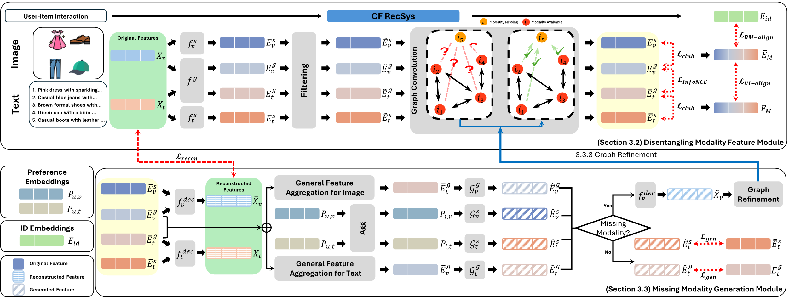

# DGMRec

The official source code for [**DGMRec: Disentangling and Generating Modalities for Recommendation in Missing Modality Scenarios**](https://arxiv.org/abs/2504.16352) (**SIGIR 2025**).

## Overview

Multi-modal recommender systems (MRSs) have demonstrated significant success in improving personalization by leveraging diverse modalities such as images, text, and audio. However, they face two critical challenges: (1) addressing missing modality scenarios and (2) effectively disentangling shared and unique characteristics of modalities.
To overcome these challenges, we propose **D**isentangling and **G**enerating **M**odality **Rec**ommender (DGMRec), a novel framework designed for missing modality scenarios.
DGMRec disentangles modality features into general and specific modality features from an information perspective, and generates missing modality features by integrating aligned features from other modalities and leveraging modality preferences.



## Repository layout

| Path | Purpose |
|---|---|
| `src/` | Source code for all models and datasets |
| `src/configs/best/<Model>/` | Per-dataset configurations |
| `data/masks/` | Missing-modality masks and interaction splits |
| `scripts/` | Data download |

## Environment

    conda create -n dgmrec python=3.9
    conda activate dgmrec
    pip install -r requirements.txt

## Dataset

    bash scripts/download_data.sh <dataset>      # baby / sports / clothing / elec

Feature files are downloaded from Google Drive ([Baby/Sports/Clothing/Elec](https://drive.google.com/drive/folders/13cBy1EA_saTUuXxVllKgtfci2A09jyaG?usp=sharing), provided by [MMRec](https://github.com/enoche/MMRec)).

## Usage

    ./run.sh <MODEL> <DATASET> [SEED]        # e.g. ./run.sh DGMRec baby 999

or with Docker:

    docker build -t dgmrec .
    docker run --gpus all -v $PWD/data:/workspace/data dgmrec DGMRec baby 999

- `MODEL` ∈ DGMRec, LGMRec, GUME, DAMRS, MGCN, BM3, LATTICE, SLMRec, GRCN, MMGCN, VBPR, MFBPR, NGCF, SGL, SimGCL, LightGCN, MILK, SIBRAR, CI2MG
- `DATASET` ∈ baby, sports, clothing, elec
- For the missing-modality + new-item setting, pass `--new_items 1` to `src/main.py`.
- Configurations: Tables 2–4 use `src/configs/best/<Model>/<dataset>.json`; Table 5 (ablation) is described in `src/configs/best/DGMRec/README.md`.

## Baselines included

| Category | Models |
|---|---|
| Traditional CF | MFBPR, NGCF, LightGCN, SGL, SimGCL |
| Multi-modal RS | VBPR, MMGCN, GRCN, SLMRec, BM3, LGMRec, LATTICE, DAMRS, MGCN, GUME |
| Missing-modality-aware RS | MILK, SIBRAR, CI2MG |

## TikTok

The TikTok dataset is no longer publicly distributed. This repository includes its interaction data, splits, and missing-modality masks; the raw multimodal features are not included.

## Citation

```bibtex
@inproceedings{kim2025dgmrec,
  title={Disentangling and Generating Modalities for Recommendation in Missing Modality Scenarios},
  author={Kim, Jiwan and Kang, Hongseok and Kim, Sein and Kim, Kibum and Park, Chanyoung},
  booktitle={Proceedings of the 48th International ACM SIGIR Conference on Research and Development in Information Retrieval},
  year={2025}
}
```
