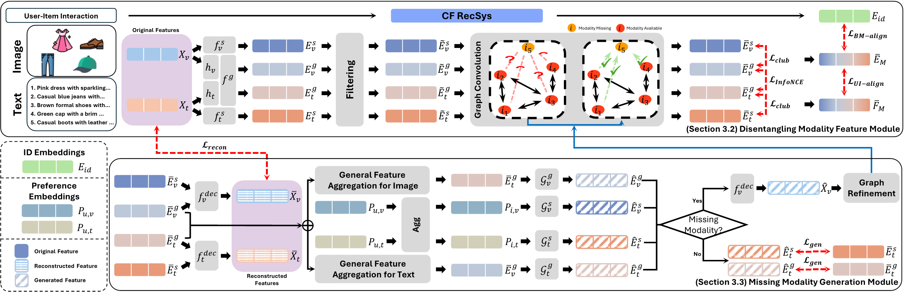

# DGMRec
The official source code for **DMGRec: Disentangling and Generating Modalities for Recommendation in Missing Modality Scenarios**

## Overview
Multi-modal recommender systems (MRSs) have demonstrated significant success in improving personalization by leveraging diverse modalities such as images, text, and audio. However, they face two critical challenges: (1) addressing missing modality scenarios and (2) effectively disentangling shared and unique characteristics of modalities, leading to severe performance degradation. 
To overcome these challenges, we propose **D**isentangling and **G**enerating **M**odality **Rec**ommender (DGMRec), a novel framework designed for missing modality scenarios.
DGMRec disentangles modality features into general and specific modality features from an information perspective to achieve better representations for recommendation.
Building on this, DGMRec generates missing modality features by integrating aligned features from other modalities and leveraging modality preferences, enabling the accurate reconstruction of missing modalities.
Extensive experiments demonstrate that DGMRec consistently outperforms state-of-the-art MRSs in challenging scenarios, including missing modalities and new item settings as well as diverse missing ratios and varying levels of missing modalities.
Beyond recommendation tasks, DGMRec's generation-based method enables cross-modal retrieval, which is inapplicable for existing MRSs, demonstrating its adaptability and potential for real-world applications.

## Environment
    conda create -n [env name] python=3.8
    conda activate [env name]
    pip install -r requirements.txt

## Dataset
Download from Google Drive: [Baby/Sports/Clothing](https://drive.google.com/drive/folders/13cBy1EA_saTUuXxVllKgtfci2A09jyaG?usp=sharing)
The data already contains text and image features extracted from Sentence-Transformers and CNN, which is provided by [MMRec](https://github.com/enoche/MMRec).
Please move your downloaded data into the folder for model training.

## Missing Modality Setting
    cd data
    python missing_items.py --dataset [dataset]

## Training / Test
    cd src
    python main.py --dataset [dataset] \
        --missing_items 1 # 1 : Missing Modality Setting, 0 : No Missing Modality Setting

